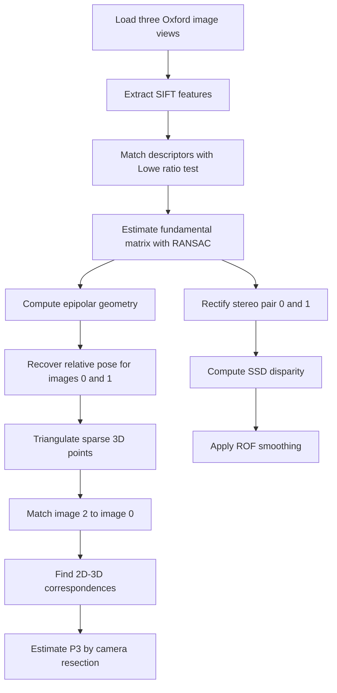

# Process pipeline for `mv_stereo_reconstruction_2.ipynb`

This notebook demonstrates how several 2D images of the same rigid scene can be turned into:

- a sparse relative 3D reconstruction,
- estimated camera matrices for multiple views,
- dense stereo disparity maps,
- smoothed disparity maps using ROF total-variation denoising.

The result is relative, not metric. The notebook does not use a measured camera calibration, so the 3D scale and absolute geometry are approximate. The goal is to demonstrate the geometric pipeline and the checks that show each stage is plausible.

## Pipeline overview



## Stage 1: Input images

**Notebook cells:** 4-5

The notebook loads three grayscale images:

- `figures/001.jpg`
- `figures/002.jpg`
- `figures/003.jpg`

These images are different views of the same scene. The whole reconstruction depends on the scene being mostly static and on having enough visual overlap between the views.

**Why this works:** multiple views create parallax. If the same physical point appears in two or more images at different pixel locations, geometry can infer the camera relation and the 3D point location.

## Stage 2: Detect and match local features

**Notebook cells:** 6-8

The notebook uses SIFT to detect keypoints and descriptors in every image. It then matches descriptors between image pairs:

- image 0 to image 1,
- image 0 to image 2.

Lowe's ratio test keeps a match only when the best descriptor match is clearly better than the second-best match.

**Why this works:** SIFT features are designed to be repeatable under moderate viewpoint, scale, and illumination changes. The ratio test removes ambiguous texture matches before geometry is estimated.

**Observed checkpoint:**

- image feature counts: about 2500 per image,
- raw matches image 0-1: 434,
- raw matches image 0-2: 606.

## Stage 3: Estimate epipolar geometry with RANSAC

**Notebook cells:** 9-12

The fundamental matrix `F` describes the epipolar constraint:

```text
x2.T F x1 = 0
```

For a correct correspondence, the point in image 2 should lie on the epipolar line predicted from the point in image 1.

The notebook estimates `F` in two related ways:

- OpenCV RANSAC is used to reject bad matches robustly.
- A normalized eight-point implementation is run on the inliers to demonstrate the textbook method from Solem.

**Why this works:** wrong feature matches do not usually agree with one global epipolar geometry. RANSAC repeatedly fits `F` to small samples and keeps the model supported by the largest consistent set of matches.

**Observed checkpoint:**

- raw matches image 0-1: 434,
- RANSAC inliers image 0-1: 245,
- pose inliers after `recoverPose`: 244.

This shows that more than half of the raw matches agree with a single two-view geometry, which is enough for a stable demonstration.

## Stage 4: Recover camera pose and triangulate 3D points

**Notebook cells:** 13

The notebook creates an approximate intrinsic calibration matrix `K`:

```text
f = 1.2 * max(width, height)
cx = width / 2
cy = height / 2
```

Then it computes an essential matrix:

```text
E = K.T F K
```

From `E`, `cv2.recoverPose` estimates the relative rotation `R` and translation direction `t` between image 0 and image 1.

The first camera is set to a canonical pose:

```text
P1 = [I | 0]
```

The second camera is:

```text
P2 = [R | t]
```

The notebook triangulates corresponding normalized image points using SVD. For each match, triangulation solves for the 3D point whose projection best agrees with both camera rays.

**Why this works:** each matching pixel defines a 3D ray from a camera center. With two cameras, the corresponding rays should intersect or nearly intersect. Triangulation finds the best 3D point for the pair of rays.

**Observed checkpoint:**

- triangulated 3D points: 244.

Because the calibration is approximate, the reconstruction is useful for demonstrating structure and camera layout, not for measuring real distances.

## Stage 5: Add the third image by camera resection

**Notebook cells:** 14-17

The third image is added using resection. The notebook:

1. matches image 2 back to image 0,
2. checks which image-0 keypoints already have triangulated 3D points,
3. builds 2D-3D pairs: known 3D point `X` and observed image-2 pixel `x`,
4. estimates the third camera matrix `P3` using DLT resection inside RANSAC,
5. verifies `P3` by projecting the 3D points back into image 2.

**Why this works:** once 3D points are known, a new camera can be estimated from where those 3D points appear in the new image. This is the reverse of triangulation:

- triangulation: known cameras + 2D points -> 3D point,
- resection: known 3D points + 2D points -> camera matrix.

**Observed checkpoint:**

- RANSAC inliers image 0-2: 418,
- usable 2D-3D correspondences for image 2: 93,
- resection inliers: 93,
- mean reprojection error: about 0.91 px,
- median reprojection error: about 0.75 px,
- 90th percentile reprojection error: about 1.68 px.

The small reprojection errors show that the estimated `P3` maps the known 3D points back close to their observed locations in image 2.

## Stage 6: Rectify image pair for stereo

**Notebook cells:** 18-19

The notebook rectifies images 0 and 1 using `cv2.stereoRectifyUncalibrated`.

Rectification warps the two images so corresponding points lie on the same horizontal scanline. After rectification, stereo matching becomes a 1D search along each row instead of a 2D search over the full image.

**Why this works:** epipolar geometry says that a match must lie somewhere on an epipolar line. Rectification transforms those epipolar lines into horizontal rows.

**Observed checkpoint:**

- rectified: `True`.

## Stage 7: Compute SSD stereo disparity

**Notebook cells:** 18-20

The notebook computes dense disparity maps for patch sizes:

- 7 x 7,
- 11 x 11,
- 19 x 19.

For each pixel and candidate disparity, it compares a patch in the left image with a shifted patch in the right image using sum of squared differences:

```text
SSD(d) = sum((left_patch - right_patch_shifted_by_d)^2)
```

The disparity with the lowest SSD score is selected.

**Why this works:** after rectification, a nearby scene point should look similar in both images but shifted horizontally. Larger disparity means larger horizontal shift, which usually corresponds to closer scene structure.

**Observed checkpoint:**

| Patch size | Valid pixels | Median disparity | Disparity std |
|---:|---:|---:|---:|
| 7 | 775716 | 5.00 | 32.22 |
| 11 | 772156 | 5.00 | 31.74 |
| 19 | 758012 | 6.00 | 31.37 |

**Patch-size tradeoff:**

- Small patches preserve sharper depth changes but are noisier.
- Large patches reduce noise but blur across depth boundaries.

## Stage 8: Smooth disparity with ROF denoising

**Notebook cells:** 21-23

The raw SSD disparity contains speckle and local matching errors. The notebook applies ROF smoothing, a total-variation denoising method.

ROF tries to keep the output close to the input while penalizing excessive variation:

```text
min_U ||U - D||^2 + lambda * TV(U)
```

where:

- `D` is the raw disparity map,
- `U` is the smoothed map,
- `TV(U)` penalizes noisy local variation while allowing stronger edges.

**Why this works:** real surfaces are often piecewise smooth, but object boundaries should remain sharp. Total variation smoothing is better suited to this than simple averaging because it reduces isolated noise without blurring all edges equally.

**Observed checkpoint:**

| Patch size | ROF iterations | Disparity misfit RMS |
|---:|---:|---:|
| 7 | 61 | 7.6206 |
| 11 | 59 | 5.5396 |
| 19 | 52 | 3.8006 |

The larger patch has lower ROF misfit because its raw disparity map is already smoother. The smaller patch needs more correction because it contains more local noise.

## Demonstration narrative

A good way to present the notebook is:

1. **Start with the three input views.** Explain that multi-view reconstruction uses repeated scene points observed from different camera positions.
2. **Show SIFT matches.** Emphasize that descriptor matching gives candidate correspondences, but not all of them are correct.
3. **Show RANSAC inliers.** This is the first major quality check: correct matches agree with one fundamental matrix.
4. **Explain epipolar geometry.** Use `x2.T F x1 = 0` as the central two-view constraint.
5. **Recover relative camera pose.** Explain that `F` plus approximate calibration gives `E`, and `E` gives `R` and `t`.
6. **Triangulate sparse 3D points.** The two-view correspondences become a relative 3D point cloud.
7. **Add image 2 by resection.** Use the reprojection error as the main evidence that the estimated third camera is consistent.
8. **Switch from sparse to dense stereo.** Rectification turns correspondence search into horizontal disparity search.
9. **Compare SSD patch sizes.** Discuss noise versus boundary sharpness.
10. **Apply ROF smoothing.** Explain that the final maps demonstrate regularized depth estimation.

## Main assumptions and limitations

- The scene is mostly rigid and static.
- Images have enough overlap and texture for SIFT.
- The approximate calibration matrix makes the reconstruction relative, not metrically accurate.
- SSD stereo assumes similar brightness between the two rectified images.
- Occlusions, repetitive patterns, and low-texture regions can produce wrong disparities.
- ROF smoothing improves visual coherence but can also remove small real depth details if the weight is too high.

## One-sentence summary

The notebook first proves sparse geometric consistency with feature matches, epipolar geometry, camera pose, triangulation, and resection; then it uses the same two-view geometry to rectify the images, estimate dense disparity by SSD, and clean the disparity with ROF smoothing.
