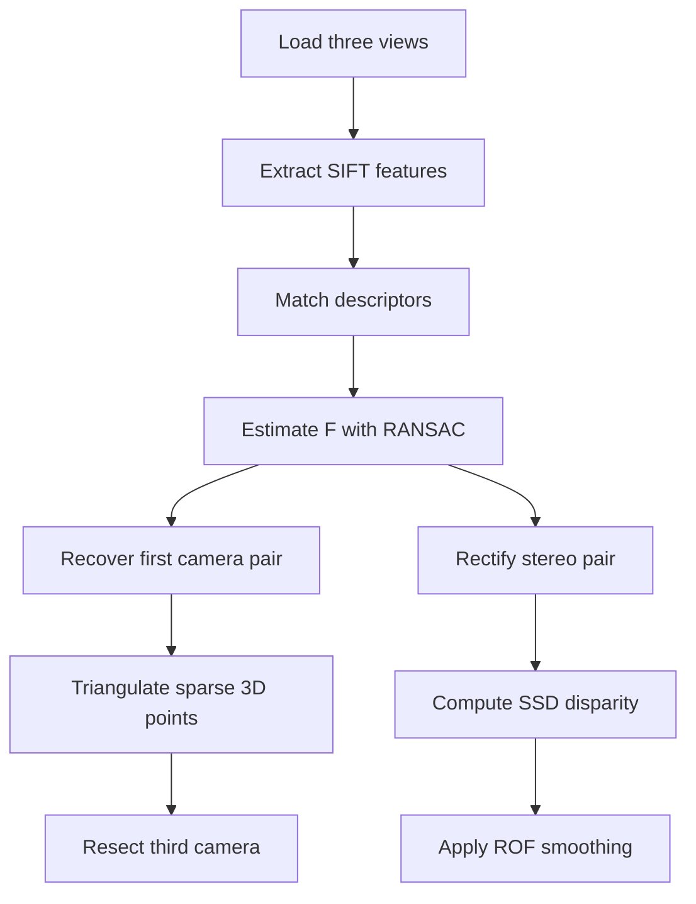

# Pipeline notes for `mv_stereo_reconstruction.ipynb`

This notebook demonstrates a small multi-view reconstruction pipeline from three images of the same rigid scene. It produces:

- a sparse relative 3D reconstruction,
- camera matrices for three views,
- SSD stereo disparity maps,
- ROF-smoothed disparity maps.

The 3D reconstruction is not metric. The notebook uses an approximate camera calibration because measured intrinsics are not provided with the input images used here.

## Input data

The notebook uses the three `University Library` views from the [Oxford VGG Multi-view Data](https://www.robots.ox.ac.uk/~vgg/data/mview/) page:

- `figures/001.jpg`
- `figures/002.jpg`
- `figures/003.jpg`

## Pipeline

## Stages

### 1. Feature matching

SIFT features are extracted in each image. Descriptor matches are filtered with Lowe's ratio test before geometry is estimated.

Observed matches:

- image 0 to 1: 434 raw matches,
- image 0 to 2: 606 raw matches.

### 2. Epipolar geometry

OpenCV RANSAC rejects feature matches that do not agree with one fundamental matrix. The notebook also includes a normalized eight-point implementation to show the linear estimation step directly.

Observed checks for image pair 0 to 1:

- 245 RANSAC inliers,
- 244 pose inliers after `recoverPose`.

### 3. Two-view reconstruction

The first camera is set to `P1 = [I | 0]`. The relative pose of the second camera gives `P2 = [R | t]`. Matched points from the first image pair are triangulated into a sparse 3D point set.

Observed result:

- 244 triangulated 3D points.

### 4. Third-view resection

Image 2 is matched back to image 0. Shared image-0 keypoints connect known 3D points to their observations in image 2, giving 2D to 3D correspondences for estimating `P3`.

Observed checks:

- 418 RANSAC inliers for image pair 0 to 2,
- 93 usable 2D to 3D correspondences,
- 0.91 px mean reprojection error for the estimated third camera.

### 5. Stereo disparity

Images 0 and 1 are rectified with `cv2.stereoRectifyUncalibrated`. After rectification, SSD patch matching searches horizontally over disparity values. The notebook compares `7 x 7`, `11 x 11`, and `19 x 19` patches.

Smaller patches retain sharper changes but show more noise. Larger patches smooth the map but blur across depth boundaries.

### 6. ROF smoothing

ROF total-variation denoising is applied to the disparity maps. The notebook compares raw and smoothed maps and also varies the TV weight for the `11 x 11` disparity result.

## Limitations

- The reconstruction has arbitrary scale because the calibration is approximate.
- Uncalibrated rectification can shear or crop image content.
- SSD matching is sensitive to occlusion, repeated texture, low-texture areas, and brightness changes.
- A fuller reconstruction system would normally use calibrated cameras, more views, and bundle adjustment.
